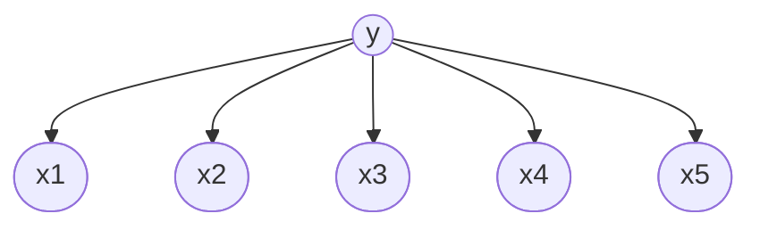

贝叶斯信念网络(BN)是一种通过建模一系列随机变量的条件概率关系从而建模它们的联合分布的方法。
但在实际应用中，我们的最终目的不一定求出严格的联合分布，而是使用BN表达的联合分布来构建一些分类器或其他机器学习模型来解决实际问题。
BN是一种更加抽象的思路，在分类器中对特征各个维度进行建模只是其中一个应用，朴素贝叶斯分类器则是贝叶斯信念网络在分类场景下一种特殊的极端特殊的建模方式。

## 有向无环图
对于一系列随机变量$X_1,\cdots,X_n$,我们用一个有向无环图来表示他们之间的条件概率的依赖关系。
每个随机变量是一个节点，每条有向边表示父节点对子节点具有条件概率的影响。
对于任意一个节点$X_i$,设它的所有父节点为$\{Pa_{i1},\cdots,Pa_{ij}\}$,设$X_i$对父节点的条件概率为
$$
P(X_i|Pa_{i1},\cdots,Pa_{ij})
$$

贝叶斯信念网络的唯一假设是**一个节点与其非后代节点之间，在给定父节点的情况下的条件概率，是独立的**
于是所有随机变量的联合分布被建模为
$$
P(X_1,\cdots,X_n)=\prod_{i=1}^nP(X_i|Pa_{i1},\cdots,Pa_{ij})
$$

例如，在**朴素贝叶斯分类器中**，特征独立性假设就可以用下面的BN来描述：

- BN树深度为1
- 分类标签y是特征各个维度$x_i,\cdots,x_n$的父节点
- 即表示给定类别标签时，各个特征的条件概率是独立的

在构造一个BN时，常见的思路是

- 根据随机变量的物理意义，人为给定随机变量的依赖关系(即BN的DAG结构),然后根据数据来估计条件概率
- 给定一部分随机变量的依赖关系，剩余的依赖关系排列组合，根据数据计算出条件概率，最后选择一个最优的组合
- 完全不假设DAG结构，遍历所有排列组合。（这种方法在对大多数情况下不可行，因为很多不同的DAG在有限数据下会变现出相同的结果，或存在Markov等价的DAG,这涉及到马尔科夫随机场的理论，在此不做展开）

