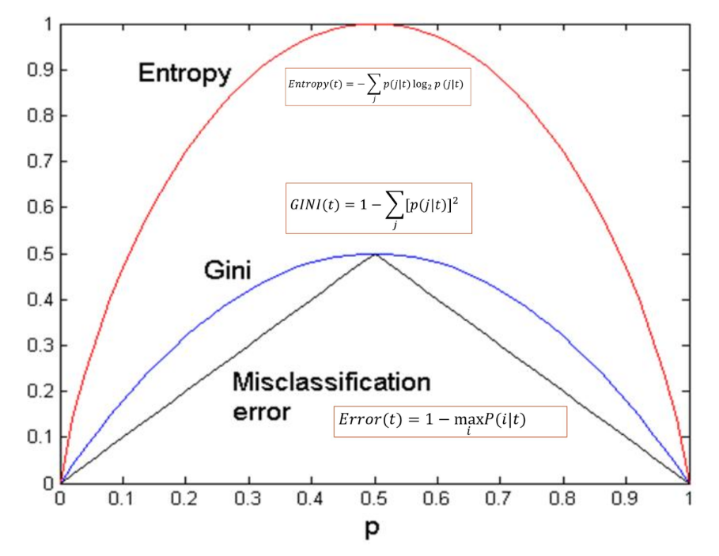

**决策树**是一类基于**树结构**的监督学习模型，可用于**分类**和**回归**任务。  

它通过对特征空间进行一系列**条件划分（if–else 规则）**，将样本逐步划分到不同的叶节点，并在叶节点给出预测结果。

下面我们都以分类问题为背景来展开。

决策树的每个叶子节点对应一个分类标签，每个内部节点(包含根节点)对应特征的一个维度；分类标签和特征维度都可以分别被多个叶子节点和内部节点来使用。

决策树的每一个内部节点都会把该节点上的样本分成两部分送到后续的节点，其中根节点的样本就是所有的训练数据。

## Hunt算法

Hunt算法是生成决策树的通用框架，规定了节点分裂的基础规则。
Hunt算法判断一个节点是可继续分裂的内部节点还是叶子节点的规则如下：

- 叶子节点：
 	- 当前节点下所有数据标签相同（样本纯）,此时以这些样本的标签为该叶节点的输出标签
 	- 当前节点下样本标签不同（样本非纯），但样本不可再分裂，此时以该节点上多数样本的标签为输出标签：
  		- 所有特征在当前路径上都已经被使用过
  		- 当前节点所有样本在所有特征上取值完全相同，及几个不同标签样本在特征空间中坍缩为一个点
  		- 样本数量少于超参数所规定的最小分裂样本数
  		- 所有特征的划分信息增益都为0

- 内部节点：若样本标签不同（样本非纯），样本书大于最小分裂样本书且存在具有信息增益的可用特征，则选择一个信息增益最大的特征并找到该特征的划分方式，继续向下分裂。

## 节点分裂准则

每次节点分裂，应使得子节点对应的分类结果尽可能确定，分类的“确定性”表述为*样本纯度*

### 熵

熵用于衡量一个随机变量的不确定性
随机变量X的熵定义为，$-log(p(X)$的期望

对于离散型随机变量X：
$$
h(X)=-\sum_{i=1}^kP(X=k)log(P(X=k))
$$
对于连续型随机变量X：
$$
h(X)=-\int f_X(x)logf_X(x)dx
$$

### Gini系数

设一个数据集D中共k个类，各个类别的样本的比例分别为$p_1,\cdots,p_k$
则Gini系数定义为
$$
Gini(D)=1-\sum_{i=1}^kp_i^2
$$

### 节点样本纯度

$$
H(D)=-\sum_{i=1}^kP(Y=i)log(P(Y=i))
$$
熵越小节点纯度越高。

#### 用基尼系数定义

$$
Gini(D)=1-\sum_{i=1}^kp_i^2
$$
基尼系数越小节点纯度越高

#### 用分类误差定义

分类误差即为：用当前节点占比最高的标签作为整个节点的分类标签，导致的分类错误率
$$
error(D)=1-\max_i(p_i)
$$
分类误差越小节点纯度越高

### 敏感性

以二分类为例，设其中一类的比例为p,当p越接近0.5的时候节点不纯度越高，熵和基尼系数比错误率对p更敏感。

### 信息增益

选定一个特征$X$和该特征上的某一点进行划分，设划分后的子节点为$D_1,\cdots,D_k$
用$|D|$表示一个样本集合中样本的数量。
**信息增益表示划分后节点纯度的增长情况**

#### 用熵描述

划分后的**加权平均熵**为
$$
H(D|X)=\sum_{i=1}^k\frac{|D_i|}{|D|}H(D_i)
$$
信息增益定义为
$$
Gain(D,X)=H(D)-H(D|X)
$$

#### 用Gini系数描述

划分后的加权平均基尼系数为：
$$
Gini(D|X) = \sum_{i=1}^k \frac{|D_i|}{|D|} Gini(D_i)
$$
信息增益定义为：
$$
Gain(D, X) = Gini(D) - Gini(D|X)
$$

## 常见分裂算法

下述三种算法本质上都是依据信息增益的准则对Hunt算法的一种实现。

### ID3

- 内部节点（根节点）总是选择信息增益最大的特征进行分裂。
- 信息增益最大特征的每个可能取值产生一个分支。
- 如此分裂直到分支上每个特征都被使用过、节点完全纯净或达到最大深度。

### C4.5

- C4.5是对ID3的改进，使用**增益率**（Gain Ratio）来代替信息增益，解决ID3中偏好选择取值多的特征的问题。
- 采用**后剪枝**（Post-Pruning）技术，以减少过拟合。
- 可以处理**连续型特征**，通过选择最佳分割点将连续特征转化为离散区间。
- 对**缺失值**进行处理，使用概率分配方法来应对缺失数据。

#### C4.5的信息增益率

C4.5是对ID3的改进，使用**增益率**（Gain Ratio）来解决ID3中**偏好选择取值多的特征**的问题。增益率是信息增益和**特征固有熵**的比值，能够更公平地选择特征，尤其在特征取值多时避免其偏向。

##### 增益率的定义

增益率的计算公式为：

$$
\text{Gain Ratio}(A) = \frac{\text{Information Gain}(A)}{\text{Split Information}(A)}
$$

其中：

- **信息增益（Information Gain）**：衡量特征A划分数据集前后数据集熵的减少量。计算公式为：
  $$

 \text{Information Gain}(A) = H(D) - H(D|A)
  $$
  其中，\( H(D) \) 是数据集D的熵，\( H(D|A) \) 是在特征A上的加权平均熵。
- **分裂信息（Split Information）**：衡量特征A如何将数据集D分割成多个子集的熵。计算公式为：
  $$
  \text{Split Information}(A) = - \sum_{i=1}^k \frac{|D_i|}{|D|} \log_2 \left( \frac{|D_i|}{|D|} \right)
  $$
  其中，$D_i$ 是特征A的取值为$v_i$时的数据子集，$|D|$ 是数据集D的样本量大小。

#### C4.5的后剪枝

C4.5算法中的**后剪枝**（Post-Pruning）是一种防止过拟合的方法，用于在树构建完成后对决策树进行修剪。通过剪去那些对分类精度贡献较小的子树或节点，后剪枝可以提高模型的泛化能力。

##### 后剪枝的步骤

1. **生成完整的决策树**：
   - 使用训练数据集构建一个完全的决策树。树的构建过程包括选择信息增益或增益率最大的特征进行分裂，直到所有节点都变得纯净，或者达到预设的最大深度。

2. **评估每个非叶子节点的性能**：
   - 对于每个非叶子节点，计算其子树对验证集的分类精度。然后，评估**将该节点替换为叶子节点**后的分类精度。
   - 叶子节点的类别是该节点子树中的大多数类别（多数类标签）。

3. **剪枝判断**：
   - 如果将非叶子节点替换为叶子节点后，**分类精度提高或不变**，则剪去该节点的子树，将其替换为叶子节点。
   - 如果剪枝导致分类精度下降，则保留该节点及其子树。

4. **重复剪枝过程**：
   - 在剪枝一个节点后，可能会导致其他节点变得可剪枝。因此，需要重复这个剪枝过程，直到没有更多的节点可以剪去。

##### 后剪枝的优点
- **减少过拟合**：后剪枝能够去除决策树中过于复杂或不必要的分支，这样可以避免在训练集上过拟合。
- **提高模型的泛化能力**：通过剪去无效的分支，后剪枝能够提高决策树在新数据上的表现。
- **增强可解释性**：剪枝后的决策树通常更小、更简单，更容易理解和解释。

##### 后剪枝的缺点
- **依赖验证集**：后剪枝需要一个单独的验证集来评估剪枝后的效果。如果没有足够的验证数据，剪枝的效果可能不佳。
- **计算开销**：后剪枝需要多次遍历决策树，对每个节点进行评估，这增加了计算开销。

### CART (Classification and Regression Trees)
- 使用**基尼系数**（Gini Index）来衡量数据的纯度，通常用于回归和分类问题。
- 每次分裂选择使得**加权平均基尼系数最小**的特征进行分裂。
- 支持**二叉树结构**，即每个内部节点只能有两个子节点（左右分支）。
- 支持回归问题，在回归树中，目标是最小化**均方误差**（MSE）。
- 可以处理**连续型和离散型特征**，通过寻找最优的分裂点来处理连续特征。
